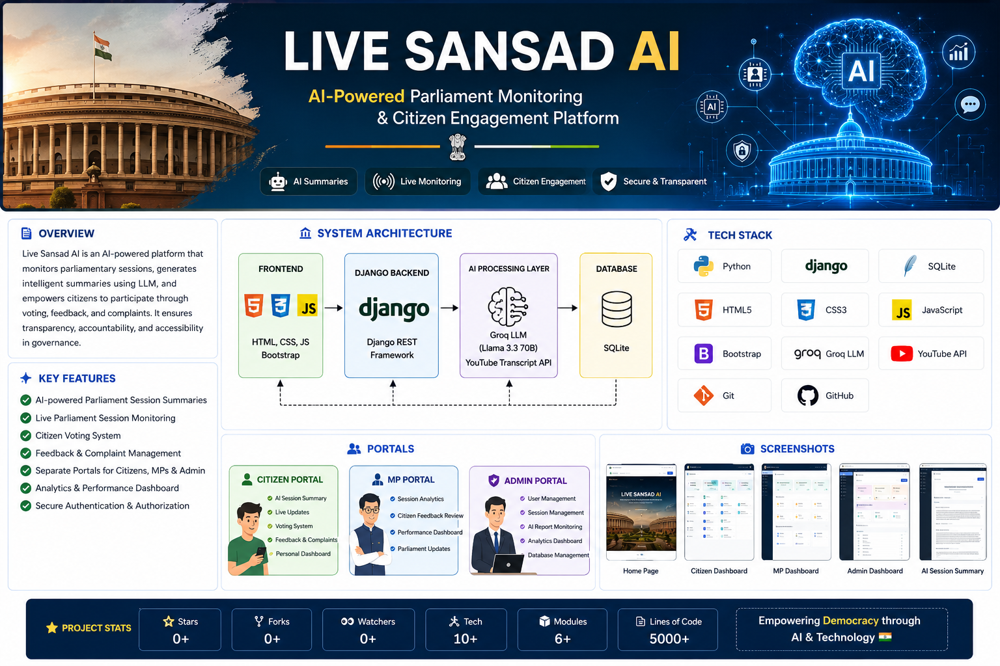
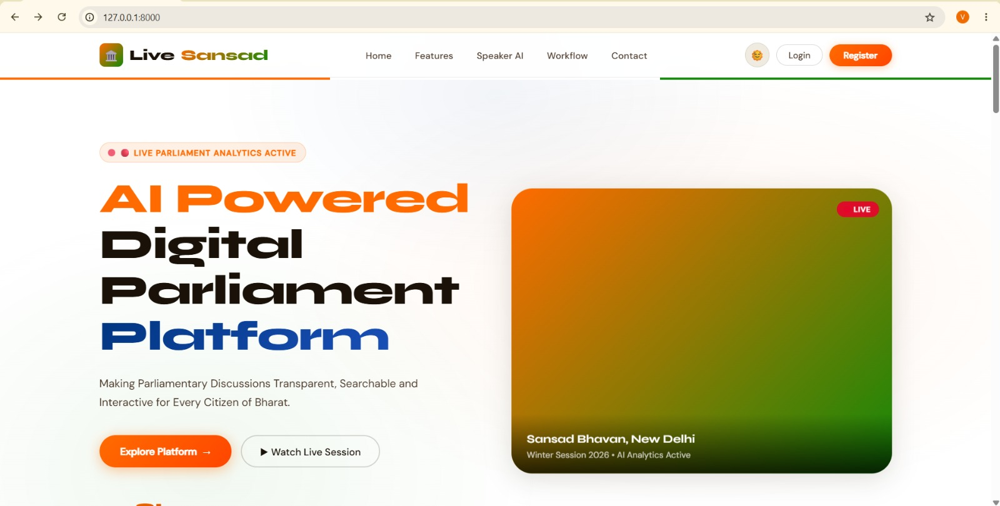
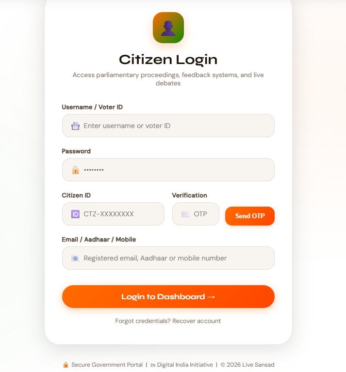
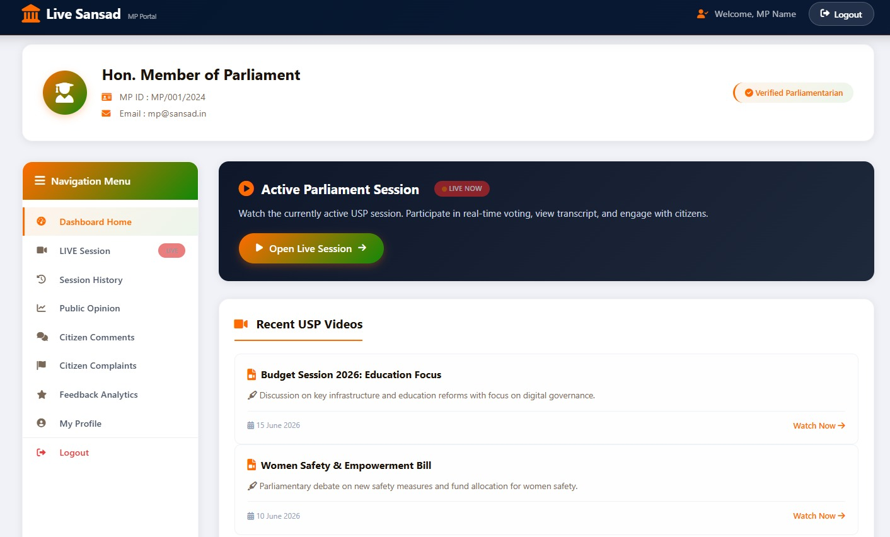
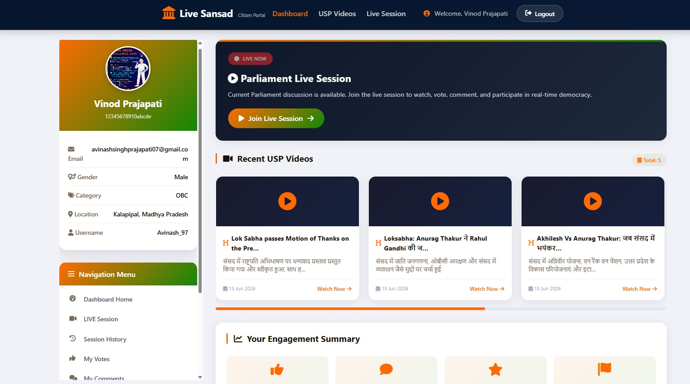
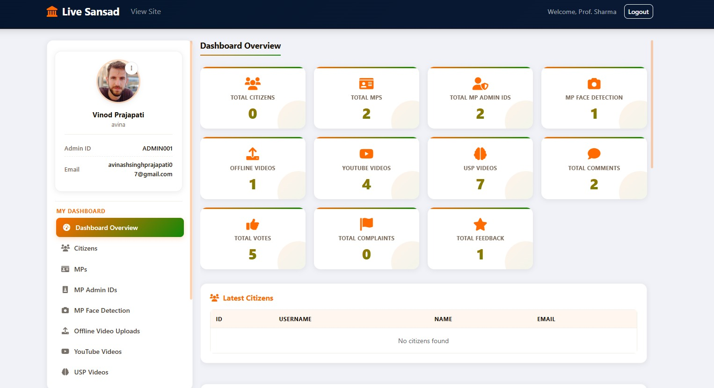

<p align="center">
  
</p>

<div align="center">

# 🏛️ Live Sansad AI
<p align="center">


</p>

### AI-Powered Parliament Monitoring & Citizen Engagement Platform


</div>

---

## 🌟 Overview

**Live Sansad AI** is an Artificial Intelligence powered Parliament Monitoring & Citizen Engagement Platform developed using **Django**, **Python**, **Groq LLM**, and **YouTube Transcript API**.

The platform automatically analyzes parliamentary sessions, generates AI-powered summaries, allows citizens to participate through voting and feedback, and provides dedicated dashboards for Citizens, Members of Parliament, and Administrators.

Its objective is to improve transparency, accessibility, and citizen participation in parliamentary proceedings using Artificial Intelligence.

---
# 🌟 Project Highlights

✨ AI-Powered Parliament Monitoring Platform

🤖 Automatic Session Summarization using Groq LLM

🎥 YouTube Transcript API Integration

🗳️ Citizen Voting & Feedback System

🏛️ Dedicated Dashboards for Citizens, MPs & Administrators

📊 Real-Time Analytics & Insights

🔐 Secure Authentication System

💬 Complaint & Suggestion Portal


# 🎯 Problem Statement

Parliament sessions are often long and difficult for citizens to follow.

Current challenges include:

- Lack of easy-to-understand session summaries
- Low citizen participation
- Limited transparency
- Difficult access to parliamentary discussions
- No centralized AI-powered platform for monitoring sessions

---

# 💡 Proposed Solution

Live Sansad AI solves these problems by providing:

- 🤖 AI-generated Parliament Session Summaries
- 🏛️ Separate Citizen, MP and Admin Portals
- 📺 Live Parliament Session Monitoring
- 🗳️ Citizen Voting System
- 💬 Complaint & Feedback System
- 📊 Interactive Dashboard
- 📈 Data Analytics
- 🔒 Secure Authentication

---

# ✨ Key Features

### 👤 Citizen Portal

- Citizen Registration & Login
- AI Session Summary
- Live Parliament Updates
- Voting System
- Feedback Submission
- Complaint Registration
- Personal Dashboard

---

### 🏛️ MP Portal

- MP Login
- Session Analytics
- Citizen Feedback Review
- Parliament Updates
- Performance Dashboard

---

### 🔐 Admin Portal

- User Management
- Session Management
- AI Report Monitoring
- Dashboard Analytics
- Complaint Management
- Database Management

---
# 🛠️ Technology Stack

| Category | Technologies |
|----------|--------------|
| **Programming Language** | Python |
| **Framework** | Django |
| **Database** | SQLite |
| **Frontend** | HTML5, CSS3, JavaScript, Bootstrap |
| **Artificial Intelligence** | Groq LLM (Llama 3.3 70B) |
| **Transcript Extraction** | YouTube Transcript API |
| **Authentication** | Django Authentication |
| **Version Control** | Git & GitHub |

---

# 📂 Project Structure

```bash
Live-Sansad-AI/
│
├── accounts/                 # User Authentication
├── adminpanel/               # Admin Dashboard
├── ai_parliament/            # Django Project Settings
├── citizen/                  # Citizen Module
├── core/                     # Core Functionalities
├── locale/                   # Language Support
├── mp/                       # Member of Parliament Module
│
├── manage.py
├── requirements.txt
├── README.md
└── .gitignore
```

---

# 🧠 AI Workflow

```text
Parliament Session Video
            │
            ▼
YouTube Transcript API
            │
            ▼
Transcript Extraction
            │
            ▼
Groq LLM (Llama 3.3 70B)
            │
            ▼
AI Summary Generation
            │
            ▼
Citizen Dashboard
            │
            ▼
Voting & Feedback
            │
            ▼
Analytics Dashboard
```

---

# ⚙️ System Workflow

```text
User
 │
 ▼
Login
 │
 ├──────────────┐
 │              │
 ▼              ▼
Citizen        MP
 │              │
 ▼              ▼
AI Summary   Session Dashboard
 │              │
 ▼              ▼
Vote        Performance Analysis
 │
 ▼
Feedback
 │
 ▼
Admin Dashboard
 │
 ▼
Reports & Analytics
```

---

# 🏗️ System Architecture

```
+----------------------+
|      Frontend        |
| HTML | CSS | JS      |
+----------+-----------+
           |
           ▼
+----------------------+
|      Django Backend  |
+----------+-----------+
           |
           ▼
+----------------------+
| Authentication Layer |
+----------+-----------+
           |
           ▼
+----------------------+
| AI Processing Layer  |
| Groq LLM + Transcript|
+----------+-----------+
           |
           ▼
+----------------------+
| SQLite Database      |
+----------------------+
```

---

# ✨ Core Modules

### 👤 Citizen Module

- Registration
- Login
- AI Session Summary
- Live Parliament Updates
- Voting
- Complaint System
- Feedback

---

### 🏛️ MP Module

- MP Authentication
- Dashboard
- Session Analytics
- Public Feedback
- Performance Tracking

---

### 🔐 Admin Module

- User Management
- Session Management
- AI Monitoring
- Database Management
- Reports
- Analytics

---
# 🎥 Live Demo

> 🚧 **Live Demo Coming Soon**

The project will be deployed on **Render**.  
The live application link will be added here after deployment.

<!-- Demo Link -->
<!-- https://your-live-demo-url -->

# 🚀 Installation Guide

### 1️⃣ Clone the Repository

```bash
git clone https://github.com/Saloni-sengar/Live-Sansad-AI.git
```

### 2️⃣ Navigate to Project Directory

```bash
cd Live-Sansad-AI
```

### 3️⃣ Create Virtual Environment

```bash
python -m venv venv
```

### 4️⃣ Activate Virtual Environment

#### Windows

```bash
venv\Scripts\activate
```

#### Linux / macOS

```bash
source venv/bin/activate
```

### 5️⃣ Install Dependencies

```bash
pip install -r requirements.txt
```

### 6️⃣ Apply Database Migrations

```bash
python manage.py migrate
```

### 7️⃣ Run Development Server

```bash
python manage.py runserver
```

Open your browser:

```
http://127.0.0.1:8000/
```

---
# 📸 Project Screenshots

## 🏠 Landing Page

<p align="center">
  
</p>

---

## 👤 Citizen Dashboard

<p align="center">
  
</p>

---

## 🏛️ MP Dashboard

<p align="center">
  
</p>

---

## 🔐 Admin Dashboard

<p align="center">
  
</p>

---

## 📊 Dashboard Overview

<p align="center">
  
</p>

## 🤖 AI Session Summary


---

# 🌍 Real-World Applications

- 🏛️ Parliament Session Monitoring
- 🤖 AI-powered Government Assistance
- 📊 Policy Analysis
- 🗳️ Digital Citizen Participation
- 📢 Public Feedback Management
- 📈 Governance Analytics
- 🌐 Smart Government Platforms

---

# 🔮 Future Scope

- 🌍 Multi-language Support
- 🎙️ Live Speech-to-Text Processing
- 📱 Android & iOS Application
- 🤖 AI Chatbot for Citizens
- 📊 Advanced Analytics Dashboard
- ☁️ Cloud Deployment
- 🔐 Aadhaar-based Authentication
- 📺 Real-time Parliament Streaming
- 🧠 Sentiment Analysis of Parliamentary Discussions

---

# 🤝 Contributing

Contributions are welcome!

1. Fork the repository
2. Create your feature branch

```bash
git checkout -b feature-name
```

3. Commit your changes

```bash
git commit -m "Add new feature"
```

4. Push to your branch

```bash
git push origin feature-name
```

5. Open a Pull Request

---
...
## 📊 Project Statistics

| Feature | Status |
|---------|--------|
| AI Integration | ✅ |
| Django Backend | ✅ |
| Citizen Portal | ✅ |
| MP Portal | ✅ |
| Admin Dashboard | ✅ |
| Groq LLM | ✅ |
| Authentication | ✅ |
| Analytics Dashboard | ✅ |

---

# 📄 License

This project is developed for **academic and educational purposes**.

---
# 👩‍💻 Author

## Saloni Sengar

**B.Tech Artificial Intelligence & Data Science Student**

💻 Passionate about Artificial Intelligence, Machine Learning, Computer Vision, Deep Learning, and Full Stack Development.

### 🌐 Connect with Me

- 💼 LinkedIn: https://www.linkedin.com/in/saloni-sengar-2a7629290/
- 💻 GitHub: https://github.com/Saloni-sengar
- 🧩 LeetCode: https://leetcode.com/u/Saloni_Sengar/
- 📚 GeeksforGeeks: https://www.geeksforgeeks.org/profile/salonisengar67/
- 📧 Email: salonisengar67@gmail.com

---

<div align="center">

## ⭐ If you found this project useful, please consider giving it a Star ⭐

**Made with ❤️ by Saloni Sengar**

</div>
